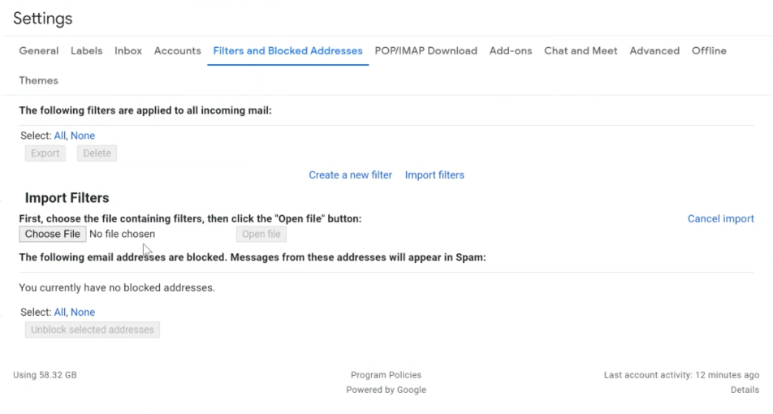

gmail-email-filter-generator
===

Generates an XML file which can be uploaded to mass create gmail email filters for Github listservs.

# Description

This is an opionated script to create mass create Github filters. It may be useful if you have github notifications
turned on for many repos and prefer to use email to review notifications.

Here is an example of what this woud look like


# Usage

1. Create a local virtual environment and source it

```bash
python3 -m venv ./venv && source ./venv/bin/activate
```

1. Run the script

```bash
> python main.py -h

usage: main.py [-h] -r REPOS -l LABEL -s LISTSERV [-f FILEPATH]

Parse command line arguments.

options:
  -h, --help   show this help message and exit
  -r REPOS     A list of repositories separated by commas
  -l LABEL     The label prefix to be used within email filters. e.g. Github
  -s LISTSERV  The suffix of the listserv, e.g. ROKT.github.com
  -f FILEPATH  An optional filepath to save the output XML file. Defaults to ./filters.xml

> python main.py -r signal-processor,necromancer -l 'CCDP Github' -s 'ROKT.github.com' && cat filters.xml
```

This will write a file called filters.xml to the local directory.

1. Click the gear icon and click “See all settings”.


1. Navigate to the “Filters and Blocked Addresses” page. Alternatively, you ought to be able to use [this link](https://mail.google.com/mail/u/0/#settings/filters).



1. Click “Choose File” and select the email filter you’d like to import. Click “Open File”.


1. Be sure to click “Apply new filters to existing email”


1. Then click “Create filters” and you should have your new filters.
